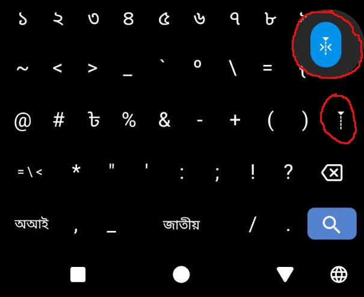

+++
title = "নন-ফোনেটিক কিবোর্ডে র‍্য (র-এ য-ফলা) লেখার উপায়"
createdAt = 2025-07-14
tags = ["বাংলা কিবোর্ড", "বাংলা ভাষা ও প্রযুক্তি"]
image = "../../assets/zwj.png"
keywords = ["", ""]
description = "নন-ফোনেটিক কিবোর্ডে (যেমন জাতীয়, প্রভাত ইত্যাদি) র‍্য লিখতে একটি বিশেষ পদ্ধতি লাগে। জেনে নিন, কীভাবে Zero Width Joiner ব্যবহার করে তা লিখবেন।"
+++

জাতীয়, প্রভাত বা অন্য কোনো নন-ফোনেটিক বাংলা কিবোর্ডে (যেখানে কী-ম্যাপিং সরাসরি ধ্বনিনির্ভর নয়) **র + য-ফলা (র‍্য)** লিখতে সমস্যা হয়—কারণ সাধারণভাবে `র`-এর পর `্য` টাইপ করলে সেটি **র্য** (রেফ + য) হয়ে যায়। এই ধরনের কিবোর্ডে **র‍্য** লেখার উপায় হলো ইউনিকোডের **Zero Width Joiner (ZWJ)** [`‍`, `U+200D`] নামক একটি অদৃশ্য ক্যারেক্টার ব্যবহার করা।

### কীভাবে লিখবেন?

1. **র** লিখুন (জাতীয়ে `v`, প্রভাতে `r`)
2. **ZWJ** টাইপ করুন (নিচে কী-কম্বিনেশন দেওয়া হলো)
3. **্য** (য-ফলা) লিখুন ( ্) হ-সন্তের সাথে য দিয়ে

### কিবোর্ডভেদে ZWJ লেখার পদ্ধতি

| কিবোর্ড     | কী-কম্বিনেশন                           |
| ----------- | -------------------------------------- |
| **জাতীয়**   | `Alt` ধরে `+` চাপুন                    |
| **প্রভাত**  | `Alt` ধরে <code>`</code> (টিল্ডা) চাপুন |

### সম্পূর্ণ টাইপিং সিকোয়েন্স

- **জাতীয়**: `v` (র) → `Alt` + `+` (ZWJ) → `g` (হ-সন্ত) → `w` (য) = **র‍্য**
- **প্রভাত**: `r` (র) → `Alt` + <code>\`</code> (ZWJ) → ` ্` (হ-সন্ত) → `Z` (য) = **র‍্য**

### অ্যান্ড্রয়েডে লেখার উপায়

 

অ্যান্ড্রয়েড কিবোর্ডে সাধারণত **Zero Width Non-Joiner** ধরে রাখলে **Zero Width Joiner** পাওয়া যায়। ছবিতে বর্ণ কিবোর্ড অ্যাপ দেখানো হল। এখানে আপনারা দুটি চিহ্ন হাইলাইট করা দেখতে পাচ্ছেন। তার মধ্যে, নিচেরটি **Zero Width Non-Joiner**, আর এটা ধরে রাখলে উপরে **Zero Width Joiner** পাওয়া যাবে।  তাছাড়া বাকি লিখন পদ্ধতি উপরের মতই।

 
পড়ার জন্য ধন্যবাদ। লেখাটি ভাল লাগলে বন্ধুদের সাথে শেয়ার করতে ভুলবেন না।

**আপনার কি প্রযুক্তি সার্ভিস প্রয়োজন? আপনার মোবাইল/কম্পিউটারে কোন সমস্যা? কিংবা আপনি কি কাস্টম রম বা লিনাক্স/উইন্ডোজ ইন্সটল করতে চান? নাকি এই ওয়েবসাইটের মত আপনার নিজস্ব একটি ওয়েবসাইট চান? তাহলে, এখনই [ইমেইল](mailto:khalidershell.duarg@slmail.me) করুন অথবা আমার টেলিগ্রাম [চ্যানেলে](https://t.me/khalidershell) মেসেজ করে যোগাযোগ করুন।**

*আমার সার্ভিস সম্পর্কে বিস্তারিত জানতে [এখানে ক্লিক করুন](https://blog.khalidrafi.me/bn/services)।*
